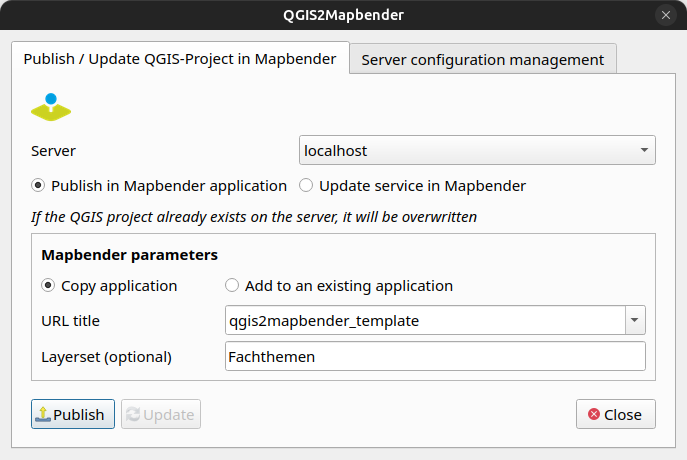

# QGIS2Mapbender

## Description
QGIS2Mapbender exports QGIS projects as WMS services served by QGIS Server and publishes them in Mapbender applications via the Mapbender API (https://mapbender.org).

The plugin supports local QGIS projects and projects stored in PostgreSQL. For local projects, the project folder and all files it contains, including local data, are uploaded to the configured server upload directory so that QGIS Server can serve the project as a WMS. Projects stored in PostgreSQL remain in the database, a `pg_service.conf` file must be available to the QGIS instance opening the project and QGIS Server must also be able to access a corresponding server-side configuration.

QGIS2Mapbender is available in the QGIS Python Plugins Repository: https://plugins.qgis.org/plugins/qgis2mapbender.

## Installation and Requirements

Please note that QGIS2Mapbender version >= 1.0.0 needs Mapbender version >= 4.1.3.

### Installing the plugin
QGIS2Mapbender is published in the QGIS plugin repository. The installation is possible directly from the QGIS plugin repository via the QGIS Plugin Manager. Click on the menu item **Plugins ► Manage and Install Plugins**.
Alternatively, a release can be downloaded here. The zipped folder can be installed manually. Click on the menu item **Plugins  ► Manage and Install Plugins**. Select the **Install from ZIP** in the Plugin Manager dialog and upload the zip.

### Requirements on your local system
- For local QGIS projects, the QGIS project must be saved in the same folder as the data. Please note that, along with the QGIS project, all the files in the folder containing the QGIS project will also be uploaded to the server.
- For PostgreSQL projects or data sources, configure a local `pg_service.conf` file for QGIS.

### Requirements on your server
- QGIS Server is installed on your server.
- Mapbender is installed and configured on your server.
- Use pg_service.conf for PostgreSQL-stored projects and/or data sources. The WMS URL for PostgreSQL-stored projects will be built as <your QGIS Server URL>?map=postgresql://?service={service}&schema={schema}&project={project_name} without exposing credentials in the public URL. The service name must be configured in a server-side pg_service.conf file that is readable by QGIS Server and match the service name used in the local pg_service.conf file.
- For PostgreSQL-stored projects, it is recommended to configure the QGIS Server environment variable `QGIS_SERVER_PROJECT_CACHE_STRATEGY` to `periodic` and set a value for `QGIS_SERVER_PROJECT_CACHE_CHECK_INTERVAL` (see https://docs.qgis.org/3.44/en/docs/server_manual/getting_started.html#httpserver).

### Requirements for your Mapbender installation

**Apache**
- Configure Apache authorisation and the Mapbender upload directory **api_upload_dir** (see https://doc.mapbender.org/en/customization/api.html)

**PHP**
- Configure the following parameters in php.ini to match the characteristics of the projects you plan to upload to the server. Remember that the folder containing your project and data will be zipped for uploading to the server.

  - **upload_max_filesize** - the maximum size of an uploaded file. 
  - **post_max_size** - maximum size of all data sent via a POST request, its value should be equal to or greater than upload_max_filesize.
  - **max_execution_time** - this sets the maximum time in seconds a script is allowed to parse input data.
  - **memory_limit** - this sets the maximum amount of memory in bytes that a script is allowed to allocate. 

**Mapbender**

- Application: Create at least one template application in Mapbender (that can be copied and can be used to publish a new WMS) or an application that will be used directly to publish a new WMS. 

- The applications should have at least one instance of a map and one layerset.
  
 Note: The field "layerset" in QGIS2Mapbender is the id or name of the layerset to use. Defaults are "main" or the first layerset in the application.

- User/Groups: All Mapbender users that should be authorized to use QGIS2Mapbender need special rights. There is only one exception and this is the Mapbender super user with the id 1, where this permission is automatically granted. 

  - User/group needs to have the global permission **access_api** and **upload_files** in order to perform any operation on the API and to be able to upload files.
  - User/group needs the global permission **view_sources**.
  - User/group needs the global permission **create_applications** to copy an application.
  - User/group need to have **view** rights on the template application to copy an application.
  - User/group needs the global permission **edit_applications** to update an application with a new source.
  - User/group needs the global permission **edit_soruces** to create a new source (publish).
  - User/group needs the global permission **update_soruces** to reload a source.

### Configuring the connection to the server 

The figure below shows a typical configuration of the connection to the server.

A few comments on a standard configuration:

| **Parameter**                                      | **Description**                                           | **Example**                          |
|----------------------------------------------------|-----------------------------------------------------------|-----------------------------------------------|
| **Mapbender base URL**                             | Link to your Mapbender landing page (application overview) | http://localhost/mapbender/  |                                                                                                                                  |
| **QGIS Server URL (for standard local projects)**  | URL to access your QGIS Server              | http://localhost/cgi-bin/qgis_mapserv.fcgi   |

### Docker

- QGIS Server and Mapbender can be run as Docker containers. Please make sure, that the Mapbender upload directory api_upload_dir has the same path as the QGIS Server project directory, as it will be used in the QGIS Server Request as path in the MAP parameter.
- A default QGIS project (environment: QGIS_PROJECT_FILE) should not be specified.

## Support
info@wheregroup.com

## License
The plugin is licensed under the attached GNU General Public License.

## Translations

Translation files are placed in the folder qgis2mapbender/i18n of the plugin. If you want to contribute a translation, please have a look at the CONTRIBUTE.md file.