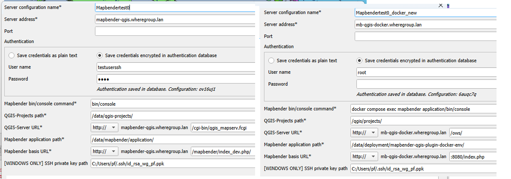

# QGIS2Mapbender

## Description
QGIS plugin to transfer your QGIS Server project on your server and publish your QGIS Server WMS in Mapbender.

## Installation and Requirements
### Installing the plugin
- To install the plugin, simply copy the folder with the plugin code into your QGIS profile folder:
  - Windows: C:\Users{USER}\AppData\Roaming\QGIS\QGIS3\profiles\{PROFILE}\python\plugins\
  - Linux: /home/{USER}/.local/share/QGIS/QGIS3/profiles/{PROFILE}/python/plugins

### Requirements on your local system
- The QGIS project must be saved in the same folder as the data.
- Install fabric2 e.g. using the QGIS console if the library is not already installed:
  ```
  import pip
  pip.main(['install', 'fabric2'])
  ```
### Requirements on your server
- QGIS Server is installed on your server.
- Mapbender is installed on your server.
- Create at least one template application in Mapbender (that will be cloned and used to publish a new WMS) or an application that will be used to publish a new WMS. These applications should have at least one layerset: 
  - layerset named "main" (default layerset for adding a new WMS to the application) OR 
  - layerset named with any other name (in this case, the name of the layerset should be specified when using the plugin)

### Docker
- QGIS Server and Mapbender can be run as Docker containers.

Here is a sample docker-compose.yml file to set up a docker for Mapbender and Qgis Server.
This configuration requires to have a folder `volumes/qgis/` that contains a QGIS project file called `/worldmap_jt/worldmap_02.qgz`

```yaml
services:
  mapbender:
    image: mapbender/mapbender
    restart: always
    ports:
      - 8080:8080
    volumes:
      - ./volumes/mapbender/db:/var/mapbender/application/var/db:rw
  qgis:
    image: qgis/qgis-server:3.36.3-noble
    restart: always
    ports:
      - 80:80
    environment:
      - QGIS_PROJECT_FILE=/qgis/projects/worldmap_jt/worldmap_02.qgz
    volumes:
      - ./volumes/qgis:/qgis/projects:ro
```

### Configuring the connection to the server 
The figure below shows a typical configuration of the connection to the server and its adaptation to a Docker virtualisation.


A few comments on a standard configuration with and without Docker:

|**Description**| **Without Docker**                                                                                                                                                                  |**With Docker**|
| :--------------------------------------- |:------------------------------------------------------------------------------------------------------------------------------------------------------------------------------------| :-------------------------- |
|QGIS-Projects path: is the path on the server, where QGIS projects are uploaded. For Docker it is necessary to specify the mount volume of the running container for QGIS Server | /data/qgis-projects                                                                                                                                                                 |{path_to_docker_compose.yml}/volumes/qgis/ for the example above|
|<p>QGIS-Server URL: relative path from server address to access QGIS-Server services</p><p></p><p></p><p></p><p></p>| <p>cgi-bin/qgis\_mapserv.fcgi</p><p></p><p>example of getCapabilities:</p><p>http://mapbender-qgis.wheregroup.lan/cgi-bin/qgis\_mapserv.fcgi?SERVICE=WMS&REQUEST=GetCapabilities</p>|<p>/ows</p><p></p><p>example of getCapabilities:</p><p>http://mb-qgis-docker.wheregroup.lan/ows/?SERVICE=WMS&REQUEST=GetCapabilities </p>|
|Mapbender application path| /data/mapbender/application                                                                                                                                                         |{path_to_docker_compose.yml}|
|Mapbender bin/console command: Mapbender's command to perform various operations (such as adding a new WMS or Mapbender project). With Docker it is necessary to execute the command in the running container.| bin/console                                                                                                                                                                         |docker compose exec mapbender bin/console|
|Mapbender basis URL: home Mapbender’s page where all application are listed| mapbender/index\_dev.php/                                                                                                                                                           |:8080/index.php/ |


## Support
info@wheregroup.com

## License
The plugin is licensed under the attached GNU General Public License.
